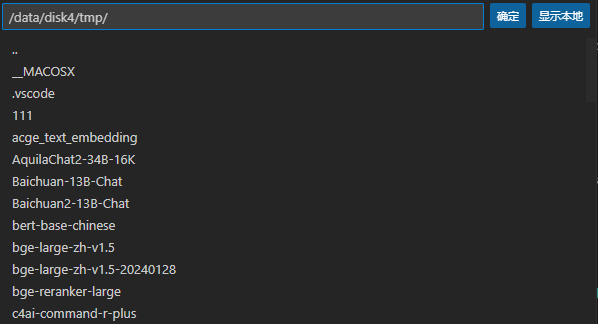

# bge_emb_finetune

bge embedding 模型微调流程  
主函数：**finetune_main.py**

1. 获得所有的疾病类型，即需要被Retrieve的数据  
get_all_label()
2. 划分微调数据集和测试数据集  
save_train_test_data()
3. 对于微调数据集，需要进行hard negatives挖掘，对微调数据集进行调整  
mine_HD_and_finetune()
4. 微调  
mine_HD_and_finetune()
5. 初始化微调后的Embeddings模型  
6. 建立index，即将需要被Retrieve的数据送入一个数据库中,数据库用index_name唯一标识  
create_corpus_index()
7. 计算准确率  
cal_precise()

## 两个sh文件
对于微调bge模型来说，在调用finetune_main.py文件需要调用两个sh文件  

1. hard_negatives_bge.sh
必须需要调整以下参数
- model_name_or_path 初始模型参数文件夹
- input_file 初始微调数据集
- output_file 挖掘hard negatives后的微调数据集
2. finetune_bge.sh
必须需要调整以下参数
- model_name_or_path 初始模型参数文件夹
- output_dir 微调后的模型参数文件夹
- train_data 就是挖掘hard negatives后的微调数据集

[注意]
1. 两个sh文件中的query_instruction_for_retrieval应该保存一致   
2. hard_negatives_bge.sh中query_instruction_for_retrieval默认为""
3. 建立index数据库应该注意index_name

## 原始模型参数
在路径/data/disk4/tmp中下载到相应位置即可  
